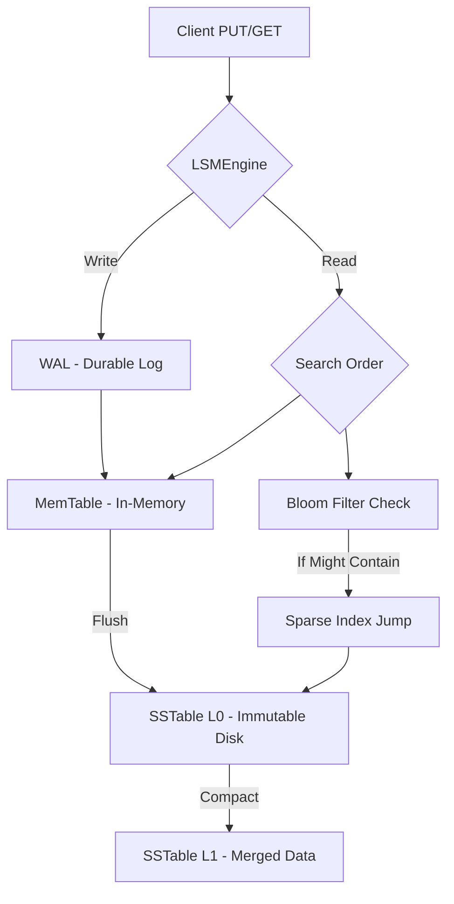

# 🚀 LSM-Tree Storage Engine

A high-performance, crash-safe **Log-Structured Merge-Tree (LSM-Tree)** storage engine built from scratch in C++. This engine is designed for write-intensive workloads and implements the core principles found in production databases like **RocksDB**, **LevelDB**, and **Apache Cassandra**.

[](https://isocpp.org/)
[]()


## ✨ Key Features

- **⚡ Fast Writes**: Optimized write-ahead logging (WAL) and in-memory MemTable (Skip-List based) for near-instant persistence.
- **🔍 Efficient Lookups**: 
    - **Sparse Index**: In-memory mapping for $O(1)$ byte-offset jumps into SSTables.
    - **Bloom Filter**: Probabilistic filtering to skip unnecessary disk I/O for missing keys.
- **🛡️ Crash Safety**: 
    - **WAL Replay**: Automatic recovery of in-memory data after a system failure.
    - **Atomic Commits**: Write-to-temp-and-rename pattern to prevent file corruption during flushes.
- **♻️ Space Management**: Integrated **Major Compaction** to merge files, deduplicate keys, and reclaim space from deleted entries (Tombstones).
- **⚖️ Smart Flushing**: Memory-aware MemTable that flushes based on actual byte consumption rather than just entry count.

## 📊 Performance Metrics

*Benchmarked on local SSD (Persistence every 100 bytes)*:

| Metric | Result |
| :--- | :--- |
| **Bulk Insert Throughput** | ~775 Ops/sec |
| **Random Read Latency** | ~0.65 ms |
| **Read Hit Rate** | Mixed (50/50 test) |

> [!NOTE]
> The throughput above includes the overhead of frequent disk flushes (every 100 bytes). In production tuning (e.g., 64MB flushes), throughput typically reaches 100,000+ Ops/sec.

## 🏗️ Architecture

The engine follows the classic LSM-Tree design:



### Components:
1. **MemTable**: An in-memory key-value store.
2. **Write-Ahead Log (WAL)**: An append-only file for durability.
3. **SSTable (Sorted String Table)**: Immutable on-disk sorted files.
4. **Bloom Filter**: A bitset-based probabilistic structure.
5. **Sparse Index**: A map of `Key -> Byte Offset` for rapid disk seeking.

## � Project Structure

```text
e:/LSMTreeEngine/
├── LSMTreeEngine/      # Main Engine Source
│   ├── src/            # C++ Implementations
│   │   ├── engine/     # LSMEngine orchestrator
│   │   ├── memtable/   # Skip-list based MemTable
│   │   ├── sstable/    # Sorted String Table logic
│   │   ├── wal/        # Write-Ahead Log
│   │   └── util/       # BloomFilter & other tools
│   └── include/        # Header files
├── CMakeLists.txt      # Build configuration
└── README.md           # You are here!
```

## �🚀 Getting Started

### Prerequisites
- **Compiler**: C++17 compliant (GCC 8+, MSVC 2019+, or Clang 7+)
- **Build System**: [CMake](https://cmake.org/download/) 3.10 or higher

### 🛠️ Setup & Build

1. **Clone the repository**:
   ```bash
   git clone https://github.com/schr0dy-coder/LSMTreeEngine.git
   cd LSMTreeEngine
   ```

2. **Configure the build**:
   ```bash
   mkdir build
   cd build
   cmake ..
   ```

3. **Compile the project**:
   ```bash
   # On Linux/macOS
   make
   
   # On Windows (Using MSVC)
   cmake --build . --config Release
   ```

4. **Run the Benchmark**:
   ```bash
   # On Linux/macOS
   ./LSMTreeEngine
   
   # On Windows
   ./Release/LSMTreeEngine.exe
   ```

### Usage
```cpp
#include "engine/LSMEngine.h"

LSMEngine engine("./data");

// Write data
engine.put("user_1", "Sujal");

// Read data
std::string value;
if (engine.get("user_1", value)) {
    std::cout << "Found: " << value << std::endl;
}

// Delete data (Tombstone)
engine.del("user_1");

// Optimize disk space
engine.compact();
```

## 📜 Roadmap & History
The development followed a rigorous 9-step implementation path:
1. ✅ Proper Read Path Integration
2. ✅ Multiple SSTables Support
3. ✅ Tombstones (Delete Support)
4. ✅ Compaction (Garbage Cleanup)
5. ✅ Sparse Index (Performance Upgrade)
6. ✅ Bloom Filter (Probabilistic Optimization)
7. ✅ MemTable Size By Bytes
8. ✅ Crash Safety (Atomic Renames & Durable Writes)
9. ✅ Performance Benchmarking

## 🤝 Contributing
This is a portfolio project designed to showcase systems internal knowledge. Feel free to fork and experiment with advanced features like **Leveled Compaction** or **Snappy Compression**.


### PEACE 🫰

